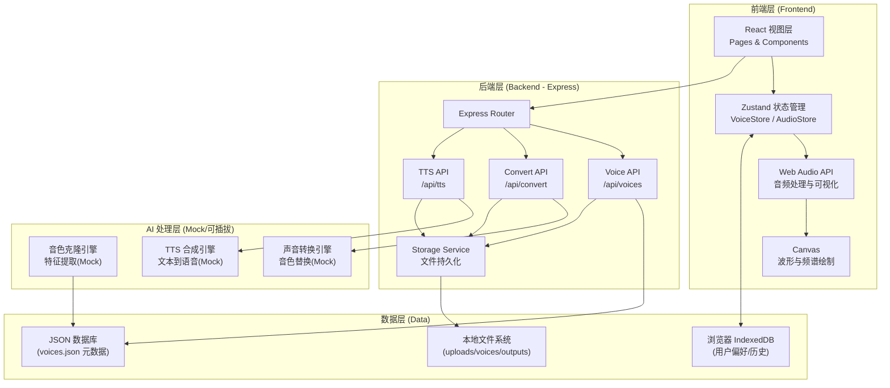
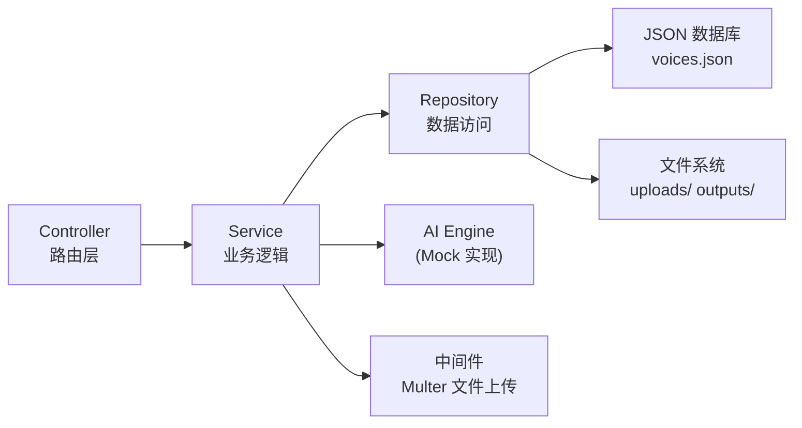
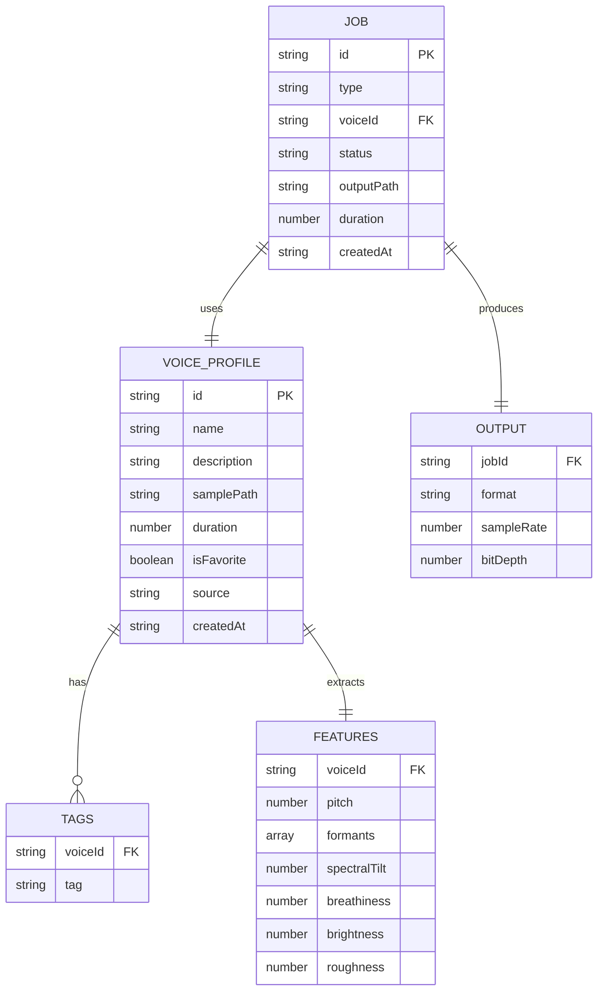

# VoiceForge 技术架构文档

## 1. 架构设计



## 2. 技术选型说明

- **前端**: React@18 + TypeScript + Tailwind CSS@3 + Vite
- **初始化工具**: vite-init (react-express-ts 模板)
- **状态管理**: Zustand
- **图标库**: lucide-react
- **后端**: Express@4 (TypeScript, ESM)
- **音频处理**: 浏览器端 Web Audio API + Canvas 波形绘制
- **数据存储**: 
  - 文件系统(音频文件)
  - JSON 文件(音色元数据)
  - IndexedDB(浏览器端用户偏好)
- **AI 引擎**: 当前采用 Mock 实现(模拟处理延迟与可视化效果),架构预留可插拔接口,后续可对接真实 AI 服务

> 说明: 真实的声音克隆与 TTS 需要重型 ML 模型(如 VITS、So-VITS-SVC、Coqui TTS),无法在浏览器内运行。本项目采用 Mock 引擎模拟完整工作流,提供真实的音频上传/下载/可视化体验,API 层设计为可插拔,便于后续接入真实 AI 后端。

## 3. 路由定义

### 3.1 前端路由

| 路由 | 用途 |
|------|------|
| `/` | 主工作台(默认进入声音转换) |
| `/convert` | 声音转换模式 |
| `/clone` | 音色克隆实验室 |
| `/library` | 音色库管理 |
| `/tts` | 文字转语音工作室 |
| `/export` | 导出中心 |

### 3.2 后端 API 路由

| 路由 | 方法 | 用途 |
|------|------|------|
| `/api/voices` | GET | 获取音色库列表 |
| `/api/voices` | POST | 保存新克隆音色 |
| `/api/voices/:id` | DELETE | 删除音色 |
| `/api/voices/:id` | PATCH | 更新音色元数据 |
| `/api/voices/:id/sample` | GET | 获取音色样本音频 |
| `/api/convert` | POST | 上传录音并转换音色 |
| `/api/clone` | POST | 上传样本进行音色克隆分析 |
| `/api/tts` | POST | 提交文本与音色 ID 进行 TTS 合成 |
| `/api/output/:id` | GET | 下载处理后的音频文件 |

## 4. API 定义

### 4.1 类型定义

```typescript
// shared/types.ts

export interface VoiceProfile {
  id: string;
  name: string;
  tags: string[];
  description?: string;
  createdAt: string;
  samplePath: string;        // 样本音频文件路径
  duration: number;          // 样本时长(秒)
  features: VoiceFeatures;   // 提取的音色特征
  isFavorite: boolean;
  source: 'preset' | 'cloned';
}

export interface VoiceFeatures {
  pitch: number;        // 基频均值 (Hz)
  formants: number[];   // 共振峰频率数组
  spectralTilt: number; // 频谱倾斜
  breathiness: number;  // 气息感 0-1
  brightness: number;    // 亮度 0-1
  roughness: number;     // 粗糙度 0-1
}

export interface ConvertRequest {
  audioBlob: File;
  targetVoiceId: string;
  options: AudioParameters;
}

export interface TTSRequest {
  text: string;
  voiceId: string;
  emotion: 'neutral' | 'happy' | 'sad' | 'excited' | 'serious';
  options: AudioParameters;
}

export interface AudioParameters {
  pitch: number;        // -12 ~ +12 半音
  speed: number;        // 0.5 ~ 2.0
  formant: number;      // -50 ~ +50
  breathiness: number;  // 0 ~ 100
  brightness: number;   // 0 ~ 100
  reverb: number;       // 0 ~ 100
  compression: number;  // 0 ~ 100
  volume: number;       // 0 ~ 100
}

export interface ConvertResponse {
  jobId: string;
  status: 'processing' | 'completed' | 'failed';
  outputPath?: string;
  duration?: number;
}

export interface TTSResponse {
  jobId: string;
  status: 'processing' | 'completed' | 'failed';
  audioPath?: string;
  estimatedDuration: number;
}
```

### 4.2 请求/响应示例

```typescript
// POST /api/clone (multipart/form-data)
// Request:
{
  "name": "主播小明",
  "tags": "男声,播音,中文",
  "description": "新闻联播风格男声",
  "sample": <File>
}
// Response:
{
  "id": "v_1690000000",
  "name": "主播小明",
  "features": {
    "pitch": 120,
    "formants": [800, 1200, 2500],
    "spectralTilt": -6,
    "breathiness": 0.2,
    "brightness": 0.7,
    "roughness": 0.3
  }
}

// POST /api/tts
// Request:
{
  "text": "你好,欢迎使用 VoiceForge。",
  "voiceId": "v_1690000000",
  "emotion": "neutral",
  "options": {
    "pitch": 0,
    "speed": 1.0,
    "formant": 0,
    "breathiness": 30,
    "brightness": 60,
    "reverb": 20,
    "compression": 50,
    "volume": 80
  }
}
// Response:
{
  "jobId": "job_tts_001",
  "status": "completed",
  "audioPath": "/api/output/job_tts_001",
  "estimatedDuration": 3.5
}
```

## 5. 服务端架构图



## 6. 数据模型

### 6.1 数据模型 ER 图



### 6.2 数据存储结构

```
/workspace
├── data/
│   ├── voices.json          # 音色元数据
│   └── jobs.json            # 任务记录
├── uploads/
│   ├── samples/             # 上传的克隆样本
│   └── recordings/          # 上传的待转换录音
├── outputs/                 # 处理后的音频输出
│   ├── convert/
│   └── tts/
└── api/
    ├── routes/
    │   ├── voices.ts
    │   ├── convert.ts
    │   ├── clone.ts
    │   └── tts.ts
    ├── services/
    │   ├── voiceService.ts
    │   ├── audioService.ts
    │   └── mockAIEngine.ts
    ├── storage/
    │   ├── fileStorage.ts
    │   └── jsonDB.ts
    └── server.ts
```

### 6.3 voices.json 初始数据结构

```json
{
  "voices": [
    {
      "id": "preset_female_01",
      "name": "柔语·女声",
      "tags": ["预设", "女声", "温柔"],
      "description": "默认预设温柔女声",
      "createdAt": "2025-01-01T00:00:00Z",
      "samplePath": "/samples/preset_female_01.wav",
      "duration": 5.0,
      "features": {
        "pitch": 220,
        "formants": [850, 1220, 2810],
        "spectralTilt": -8,
        "breathiness": 0.4,
        "brightness": 0.6,
        "roughness": 0.2
      },
      "isFavorite": true,
      "source": "preset"
    },
    {
      "id": "preset_male_01",
      "name": "醇音·男声",
      "tags": ["预设", "男声", "磁性"],
      "description": "默认预设磁性男声",
      "createdAt": "2025-01-01T00:00:00Z",
      "samplePath": "/samples/preset_male_01.wav",
      "duration": 5.0,
      "features": {
        "pitch": 120,
        "formants": [800, 1150, 2400],
        "spectralTilt": -6,
        "breathiness": 0.2,
        "brightness": 0.7,
        "roughness": 0.3
      },
      "isFavorite": false,
      "source": "preset"
    }
  ]
}
```
